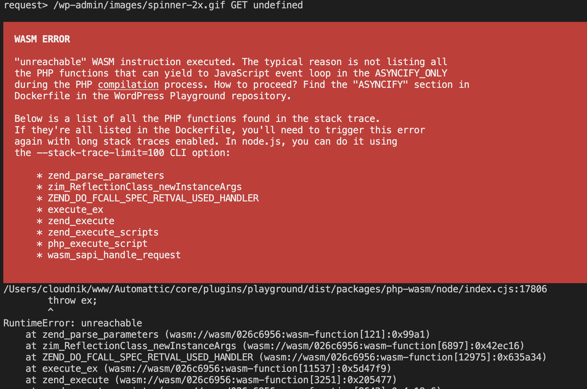

# Asyncify

[Asyncify](https://emscripten.org/docs/porting/asyncify.html) lets synchronous C or C++ code interact with asynchronous JavaScript. Technically, it saves the entire C call stack before yielding control back to JavaScript, and then restores it when the asynchronous call is finished. This is called **stack switching**.

Networking support in the WebAssembly PHP build is implemented using Asyncify. When PHP makes a network request, it yields control back to JavaScript, which makes the request, and then resumes PHP when the response is ready. It works well enough that PHP build can request web APIs, install composer packages, and even connect to a MySQL server.

## Asyncify crashes

Stack switching requires wrapping all C functions that may be found at a call stack at a time of making an asynchronous call. Blanket-wrapping of every single C function adds a **significant** overhead, which is why we maintain a list of specific function names:

https://github.com/khulnasoft-lab/wordpress-playground/blob/15a660940ee9b4a332965ba2a987f6fda0c159b1/packages/php-wasm/compile/Dockerfile#L624-L632

Unfortunately, missing even a single item from that list results in a WebAssembly crash whenever that function is a part of the call stack when an asynchronous call is made. It looks like this:

Asyncify can auto-list all the required C functions when built without `ASYNCIFY_ONLY`, but that auto-detection is overeager and ends up listing about 70,000 C functions which increases the startup time to 4.5s. That's why we maintain the list manually.

If you are interested in more details, [see GitHub issue 251](https://github.com/khulnasoft-lab/wordpress-playground/issues/251).

## Fixing Asyncify crashes

[Pull Request 253](https://github.com/khulnasoft-lab/wordpress-playground/pull/253) adds a `fix-asyncify` command that runs a specialized test suite and automatically adds any identified missing C functions to the `ASYNCIFY_ONLY` list.

If you run into a crash like the one above, you can fix it by:

1. Identifying a PHP code path that triggers the crash – the stack trace in the terminal should help with that.
2. Adding a test case that triggers a crash to `packages/php-wasm/node/src/test/php-asyncify.spec.ts`
3. Running: `npm run fix-asyncify`
4. Committing the test case, the updated Dockerfile, and the rebuilt PHP.wasm

## The upcoming JSPI API will make Asyncify unnecessary

Eventually, [V8 will likely handle stack switching for us](https://github.com/khulnasoft-lab/wordpress-playground/issues/134) and remove this problem entirely. [Issue 134](https://github.com/khulnasoft-lab/wordpress-playground/issues/134) tracks the status of that effort.

Here's [a relevant note](https://github.com/fgmccabe) from @fgmccabe:

> The current implementation in V8 is essentially 'experimental status'. We have arm64 and x64 implementations.
> The next steps are to implement on 32 bit arm/intel. That requires us to solve some issues that we did not have to solve so far.
> As for node.js, my guess is that it is already in node, behind a flag.
> To remove the flag requirement involves getting other implementations. The best estimate for that is towards the end of this year; but it obviously depends on resources and funding.
> In addition, it would need further progress in the standardization effort; but, given that it is a 'small' spec, that should not be a long term burden.
> Hope that this helps you understand the roadmap :)
